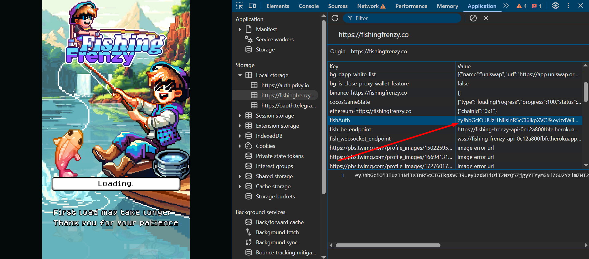

---

<h1 align="center">🎣 Fishing Frenzy Bot</h1>

<p align="center">Automate tasks in Fishing Frenzy to level up your fishing skills, upgrade your abilities, and maximize your daily rewards!</p>

---

## 🚀 About the Bot

Fishing Frenzy Bot automates various tasks in **Fishing Frenzy**, including:

- **🔌 Proxy Support:** Use dynamic proxies for each account (mandatory for multi-account setups).
- **🗺️ Quest Automation:** Automatically complete quests and events.
- **💪 Upgrade Skill:** Auto-upgrade your character's skills.
- **💰 Sell All Fish:** Automatically sell your caught fish without hassle.
- **🎣 Fishing Automation:** Enjoy fully automated fishing with configurable types and updated API support for Fishing Frenzy Session 2.
- **📅 Daily Tasks:** Handle daily activities automatically to secure extra rewards.
- **🎉 Event System:** Seamlessly switch to the event area (no need to purchase event items).
- **🌐 Web Login Support:** Login via web (supports both token and guest login).
- **🪝 Bait Usage:** Automatically use all available bait items from your inventory.
- **🍳 Auto Cooking:** Automatically process cooking recipes when ingredients are available.
- **🔖 Auto Reff:** Automatically generate new accounts using referral codes.
- **🧵 Thread System:** Run tasks concurrently for improved performance.

This bot is designed to save you time and streamline your gameplay—so you can focus on strategy and enjoy the game! 😎

---

## 📝 Register via Referral

Before you install the bot, register your account with Fishing Frenzy using your referral code.  
Click the link below to register:

[🔗 Register for Fishing Frenzy](https://fishingfrenzy.co?code=EU6HOU)

---

## 🌟 Version Updates

**Current Version: v1.0.5**

### v1.0.5 Updates:

- **💡 Full Feature Optimization:** Overall improvements in performance and stability.
- **🍳 Auto Cooking Feature:** Automatically process cooking recipes if ingredients are available.
- **🔖 Auto Reff Feature:** Automatically generate new accounts using referral codes.
- **🔗 Reff Accounts Integration:** Accounts generated via auto reff can now be run in the main bot by enabling `run_with_reff` in the configuration.

> **🚀 Upcoming Updates:**
>
> - Additional login methods via email and wallet.
> - Further feature optimizations and new automation capabilities.

---

## ⚙️ Configuration

### Main Bot Configuration (`config.json`)

| **Setting**            | **Description**                                                | **Default Value** |
| ---------------------- | -------------------------------------------------------------- | ----------------- |
| `cooking`              | Enable the auto cooking feature.                               | `true`            |
| `battle_pass`          | Automatically claim battle pass rewards.                       | `true`            |
| `quest`                | Automatically complete quests.                                 | `true`            |
| `upgrade_skill`        | Automatically upgrade your skills.                             | `true`            |
| `event`                | Automatically switch to the event area.                        | `true`            |
| `fishing`              | Enable automatic fishing.                                      | `true`            |
| `fishing_type`         | Set the fishing type (1 for short, 2 for mid, and 3 for long). | `2`               |
| `daily`                | Automatically complete daily tasks.                            | `true`            |
| `sell_all_fish`        | Automatically sell all caught fish.                            | `false`           |
| `proxy`                | Enable proxy usage for multi-account setups.                   | `false`           |
| `run_with_reff`        | Enable running accounts generated via auto reff.               | `false`           |
| `thread`               | Number of threads to run concurrently.                         | `1`               |
| `delay_loop`           | Delay (in seconds) before the next loop.                       | `3000`            |
| `delay_account_switch` | Delay (in seconds) between switching accounts.                 | `10`              |

### Reff Configuration (`config_reff.json`)

| **Setting**            | **Description**                                | **Default Value** |
| ---------------------- | ---------------------------------------------- | ----------------- |
| `proxy`                | Enable proxy usage for the auto reff system.   | `true`            |
| `thread`               | Number of threads to run concurrently.         | `1`               |
| `delay_loop`           | Delay (in seconds) before the next loop.       | `3000`            |
| `delay_account_switch` | Delay (in seconds) between switching accounts. | `10`              |

---

## 📥 Installation Steps

### Main Bot Installation

1. **Clone the Repository**  
   Clone the project to your local machine:

   ```bash
   git clone https://github.com/livexords-nw/fishingfrenzy-bot.git
   ```

2. **Navigate to the Project Folder**

   ```bash
   cd fishingfrenzy-bot
   ```

3. **Install Dependencies**

   ```bash
   pip install -r requirements.txt
   ```

4. **Configure Your Query**

   **For Main Bot (`query.txt`)**  
   Create a file named `query.txt` and add your query data. This file supports both token-based and guest logins.

   **Token Login Example:**  
   To use token login, open your browser, navigate to the Fishing Frenzy login page, and inspect the **Application** tab. Then, go to **Local Storage** and find the `fishauth` value. Copy it and use the following format:

   ```text
   auth_token|token
   1234567890abcdef|token
   0987654321fedcba|token
   ```

   **Guest Login Example:**

   ```text
   7fa317a4-0706-491b-aff4-ad2c53146018|guest
   1c1ee4be-73a7-4d54-8500-91af7ecbcedd|guest
   ```

   _Tutorial:_  
   Check out the image below for a step-by-step guide on obtaining your token from local storage:

   

5. **Set Up Proxies (Mandatory for Multi-Account Usage)**  
   If you're running multiple accounts, create a file named `proxy.txt` and add your proxies in this format:

   ```text
   http://username:password@ip:port
   ```

   > **Note:** Only HTTP and HTTPS proxies are supported.

6. **Run the Main Bot**  
   Start the bot with:

   ```bash
   python main.py
   ```

---

### Auto Reff Installation

1. **Prepare Auto Reff Files**  
   Create a file named `query_reff.txt` with the following content:

   ```text
   EU6HOU|20
   ```

   Here, `EU6HOU` is your referral code and `20` is the number of accounts you want to generate.

2. **Run the Auto Reff Module**  
   After installing dependencies (see Main Bot step 3), run:

   ```bash
   python reff.py
   ```

   The module will generate new referral accounts and save their device IDs to `result_query.txt` in the format:

   ```text
   deviceid|guest
   ```

3. **Integrate Reff Accounts**  
   To run the generated reff accounts in the main bot, enable `"run_with_reff": true` in your `config.json`.

---

## 🛠️ Contributing

This project is developed by **Livexords**. If you have suggestions, questions, or would like to contribute, feel free to reach out:

<div align="center">
  <a href="https://t.me/livexordsscript" target="_blank">
    
  </a>
</div>

---
