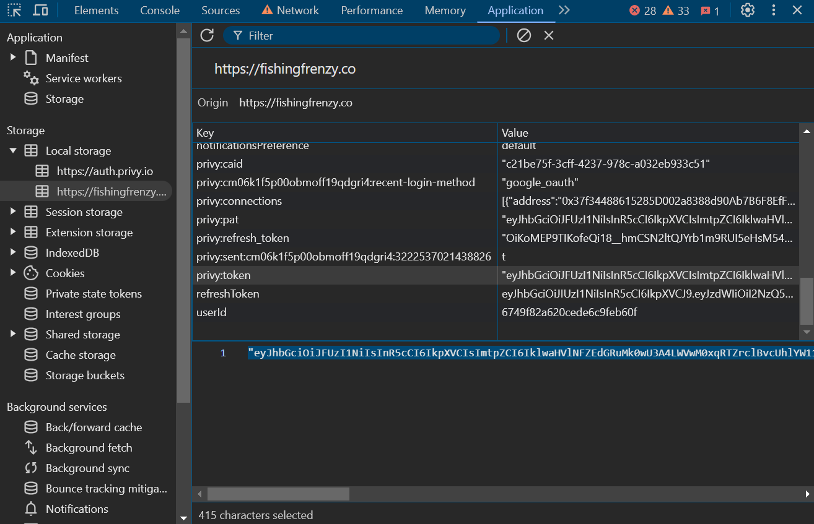

---

<h1 align="center">Fishing Frenzy Bot</h1>

<p align="center">Automate tasks in Fishing Frenzy to enhance your fishing skills, upgrade your abilities, and maximize your daily rewards!</p>

---

## 🚀 About the Bot

Fishing Frenzy Bot is designed to automate various tasks in **Fishing Frenzy**, including:

- **Proxy Support**: Use dynamic proxies for each account (**mandatory for multi-account setups**).
- **Quest Automation**: Complete quests and events automatically.
- **Upgrade Skill**: Automatically upgrade your character's skills.
- **Sell All Fish**: Sell all your fish without manual intervention.
- **Fishing Automation**: Enjoy automatic fishing with configurable types.
- **Daily Tasks**: Automatically handle daily activities for extra rewards.
- **Event System**: Automatically switch to the event area (without purchasing event items).
- **Web Login Support**: Now you can log in via web by searching for the login API.  
- **Bait Usage**: The bot now automatically uses all available bait variations from your inventory.

This bot is built to save you time and streamline your gameplay, allowing you to focus on strategy and enjoying the game.

---

## 🎣 Register for Fishing Frenzy

If you don't have a Fishing Frenzy account yet, register now:

- **Telegram Registration:**  
  👉 [Register Your Fishing Frenzy Account](https://t.me/fishingfrenzy_bot/fishingfrenzyapp?startapp=HE8W8F)

- **Web Registration:**  
  👉 [Register via Web](https://fishingfrenzy.co?code=HE8W8F)

---

## 🌟 Version v1.0.3

### Updates

- **Web Login Support:** The bot now supports logging in via web. When logging in via web, ensure you search for the login API and reset your cookie so that Fishing Frenzy returns to the login menu or logs out. See the sample authentication screen below:  
  
- **Bait Usage:** The bot now uses all available bait items across every variation from your inventory.

---

## ⚙️ Configuration (`config.json`)

> **Note:** If you are using more than one account, you **must** use proxies.

| **Setting**            | **Description**                                                              | **Default Value** |
| ---------------------- | ---------------------------------------------------------------------------- | ----------------- |
| `proxy`                | **Mandatory for multi-account setups.** Enable proxy usage for each account. | `true`            |
| `quest`                | Automatically complete quests.                                               | `true`            |
| `upgrade_skill`        | Automatically upgrade your skills.                                           | `true`            |
| `sell_all_fish`        | Automatically sell all caught fish.                                          | `true`            |
| `event`                | Automatically switch to the event area.                                      | `true`            |
| `fishing`              | Enable automatic fishing.                                                    | `true`            |
| `fishing_type`         | Set the fishing type (1 for short, 2 for mid, and 3 for long).                | `1`               |
| `daily`                | Automatically complete daily tasks.                                          | `true`            |
| `delay_loop`           | Delay (in milliseconds) before the next loop.                               | `3000`            |
| `delay_account_switch` | Delay (in seconds) between switching accounts.                               | `10`              |

---

## 📥 Installation Steps

1. **Clone the Repository**  
   Clone the project to your local machine using:

   ```bash
   git clone https://github.com/livexords-nw/fishingfrenzy-bot.git
   ```

2. **Navigate to the Project Folder**  
   Move into the project directory:

   ```bash
   cd fishingfrenzy-bot
   ```

3. **Install Dependencies**  
   Install the required Python libraries:

   ```bash
   pip install -r requirements.txt
   ```

4. **Configure Your Query**  
   Create a file named `query.txt` and paste your query data in the format obtained from the UserInfo Bot. For web login, you can search for the login API. **Make sure you reset the cookie** so that Fishing Frenzy returns to the login menu or logs out. The query data format is as follows:

   - For Telegram login:  
     ```
     id|first_username
     ```
   - For web login, simply use the login token (without a `|`):

     ```
     your_web_login_token_here
     ```

   > **Note:** To obtain the `id` and `first_username`, use this bot: [https://t.me/userinfobot](https://t.me/userinfobot)

5. **Set Up Proxies (Mandatory for Multi-Account Usage)**  
   If you are running the bot with multiple accounts, you **must** use proxies. Create a file named `proxy.txt` and add your proxies in the following format:

   ```  
   http://username:password@ip:port
   ```

   > **Note:** Only `HTTP` and `HTTPS` proxies are supported.

6. **Run the Bot**  
   Start the bot by running:

   ```bash
   python main.py
   ```

---

### 🔹 Need Free Proxies?

You can obtain free proxies from [Webshare.io](https://www.webshare.io/).

---

## 🛠️ Contributing

This project is developed by **Livexords**. If you have any suggestions, questions, or would like to contribute, please feel free to reach out:

<div align="center">
  <a href="https://t.me/livexordsscript" target="_blank">
    
  </a>
</div>

---