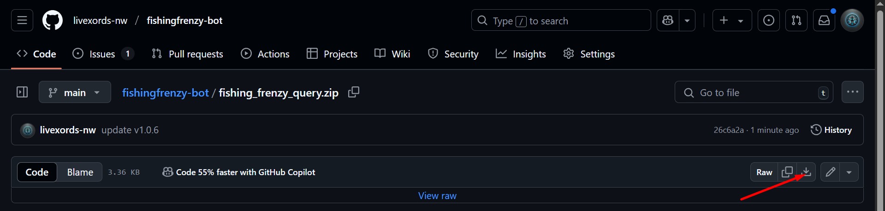
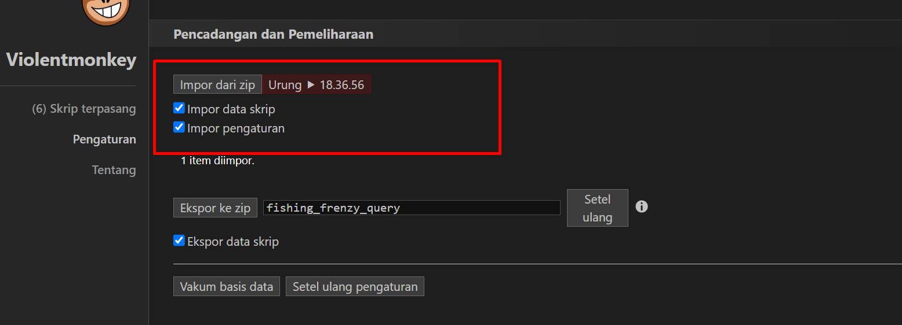
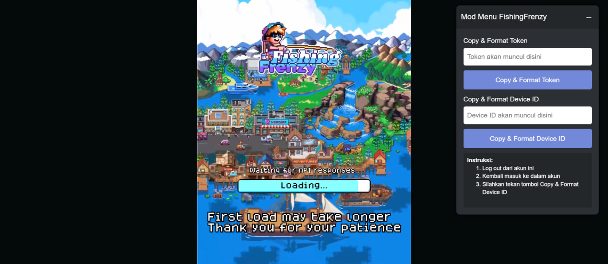

---

<h1 align="center">🎣 Fishing Frenzy Bot</h1>

<p align="center">Automate tasks in Fishing Frenzy to level up your fishing skills, upgrade your abilities, and maximize your daily rewards!</p>

---

## 🚀 About the Bot

Fishing Frenzy Bot automates various tasks in **Fishing Frenzy**, including:

- **🔌 Proxy Support:** Use dynamic proxies for each account (mandatory for multi-account setups).
- **🏟️ Quest Automation:** Automatically complete quests and events.
- **💪 Upgrade Skill:** Auto-upgrade your character's skills.
- **💰 Sell All Fish:** Automatically sell your caught fish without hassle.
- **🎣 Fishing Automation:** Enjoy fully automated fishing with configurable types and updated API support for Fishing Frenzy Session 2.
- **📅 Daily Tasks:** Handle daily activities automatically to secure extra rewards.
- **🎉 Event System:** Seamlessly switch to the event area (no need to purchase event items).
- **🌐 Web Login Support:** Login via web (supports both token and guest login).
- **🪝 Bait Usage:** Automatically use all available bait items from your inventory.
- **🍳 Auto Cooking:** Automatically process cooking recipes when ingredients are available.
- **🔖 Auto Reff:** Automatically generate new accounts using referral codes.
- **🧵 Auto Claim Reff:** Automatically claim referral rewards.
- **🷵 Thread System:** Run tasks concurrently for improved performance.

This bot is designed to save you time and streamline your gameplay—so you can focus on strategy and enjoy the game! 😎

---

## 🌟 Version Updates

**Current Version: v1.0.6**

### v1.0.6 Updates:

- **💡 Feature Optimization:** Optimization of several features such as auto fishing and auto cooking.
- **🧵 Auto Claim Reff:** Automatically claim referral rewards.
- **🔧 Violent Monkey Extension:** Added Violent Monkey extension for easier query extraction.

---

## ⚙️ Configuration

### Main Bot Configuration (`config.json`)

| **Setting**            | **Description**                                                | **Default Value** |
| ---------------------- | -------------------------------------------------------------- | ----------------- |
| `cooking`              | Enable the auto cooking feature.                               | `true`            |
| `battle_pass`          | Automatically claim battle pass rewards.                       | `true`            |
| `quest`                | Automatically complete quests.                                 | `true`            |
| `upgrade_skill`        | Automatically upgrade your skills.                             | `true`            |
| `event`                | Automatically switch to the event area.                        | `true`            |
| `fishing`              | Enable automatic fishing.                                      | `true`            |
| `daily`                | Automatically complete daily tasks.                            | `true`            |
| `sell_all_fish`        | Automatically sell all caught fish.                            | `false`           |
| `proxy`                | Enable proxy usage for multi-account setups.                   | `false`           |
| `run_with_reff`        | Enable running accounts generated via auto reff.               | `false`           |
| `thread`               | Number of threads to run concurrently.                         | `1`               |
| `delay_loop`           | Delay (in seconds) before the next loop.                       | `3000`            |
| `delay_account_switch` | Delay (in seconds) between switching accounts.                 | `10`              |

### Reff Configuration (`config_reff.json`)

| **Setting**            | **Description**                                | **Default Value** |
| ---------------------- | ---------------------------------------------- | ----------------- |
| `proxy`                | Enable proxy usage for the auto reff system.   | `true`            |
| `thread`               | Number of threads to run concurrently.         | `1`               |
| `delay_loop`           | Delay (in seconds) before the next loop.       | `3000`            |
| `delay_account_switch` | Delay (in seconds) between switching accounts. | `10`              |

---

## 📥 Installation Steps

### Main Bot Installation

1. **Clone the Repository**

   ```bash
   git clone https://github.com/livexords-nw/fishingfrenzy-bot.git
   ```

2. **Navigate to the Project Folder**

   ```bash
   cd fishingfrenzy-bot
   ```

3. **Install Dependencies**

   ```bash
   pip install -r requirements.txt
   ```

4. **Configure Your Query**

   Create a file named `query.txt` and add your query data.

---

## 🔬 Auto Reff Installation

1. **Prepare Auto Reff Files**  
   Create a file named `query_reff.txt` with the following content:

   ```text
   EU6HOU|20
   ```

   Here, `EU6HOU` is your referral code and `20` is the number of accounts you want to generate.

2. **Run the Auto Reff Module**

   ```bash
   python reff.py
   ```

3. **Integrate Reff Accounts**  
   To run the generated reff accounts in the main bot, enable `"run_with_reff": true` in your `config.json`.

---

## 💻 **Tutorial: Install the Extension**

1. **Download the Extension:**  
   Download the zip file `fishing_frenzy_query.zip` from this repository.  
   

2. **Install Violent Monkey Extension:**  
   Install the Violent Monkey extension in your browser using [this link](https://chromewebstore.google.com/detail/jinjaccalgkegednnccohejagnlnfdag?utm_source=item-share-cb).

3. **Import the Zip File:**  
   Open Violent Monkey, go to **Settings** → **Import from Zip**, and select the downloaded zip file.  
   

4. **Activate the Extension on Fishing Frenzy Website:**  
   Open the Fishing Frenzy website. If you are still logged in, please log out and log in again to ensure the extension is active.  
   Make sure the extension is working correctly as shown below:  
   

5. **Capture and Copy the Query:**  
   Once logged in, click **Format & Format Token** or **Format & Format Divace ID** on the extension.  
   Then, paste the copied result into your `query.txt` file.

---

### 🔹 Want Free Proxies? You can obtain free proxies from [Webshare.io](https://www.webshare.io/).

---

## 🛠️ Contributing

This project is developed by **Livexords**. If you have suggestions, questions, or would like to contribute, feel free to reach out:

<div align="center">
  <a href="https://t.me/livexordsscript" target="_blank">
    
  </a>
</div>

---
